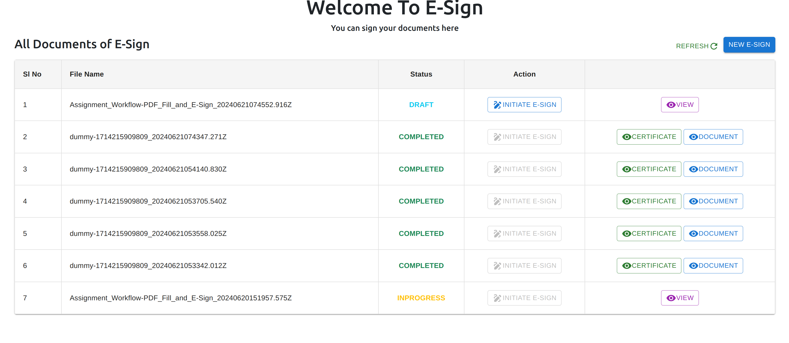
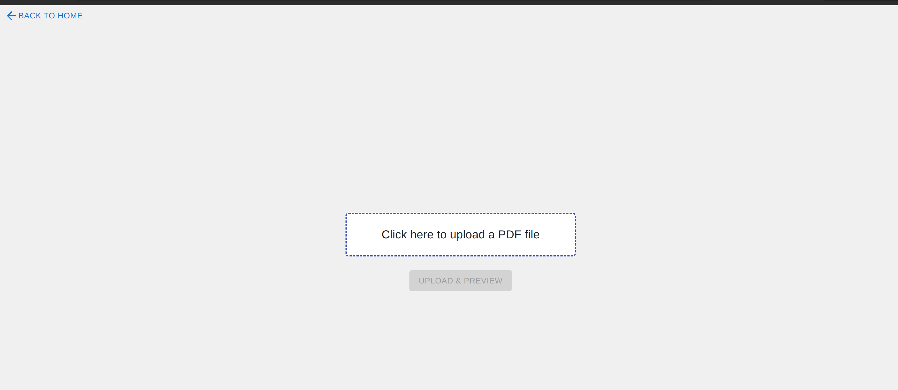
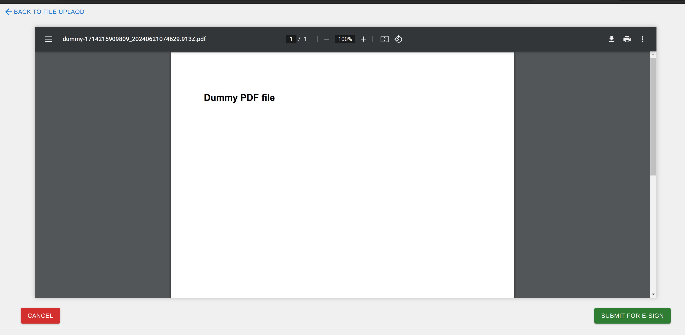
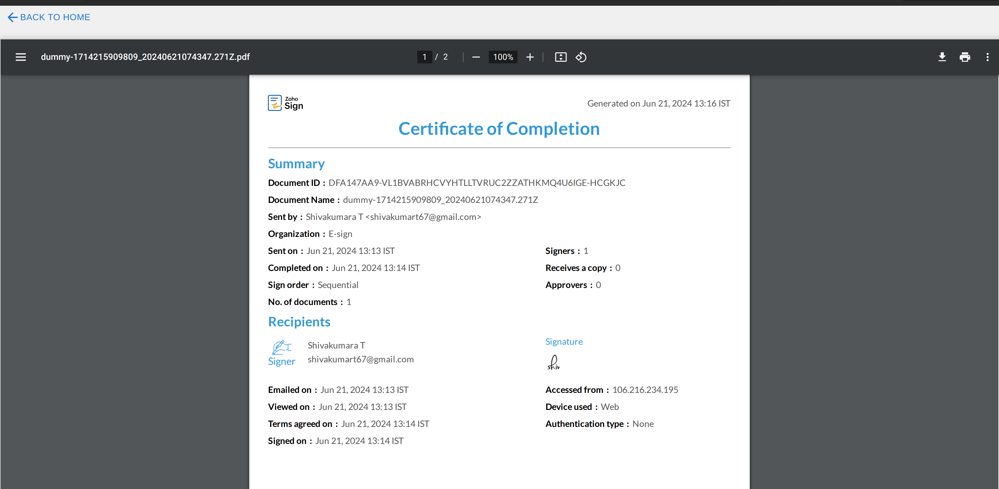
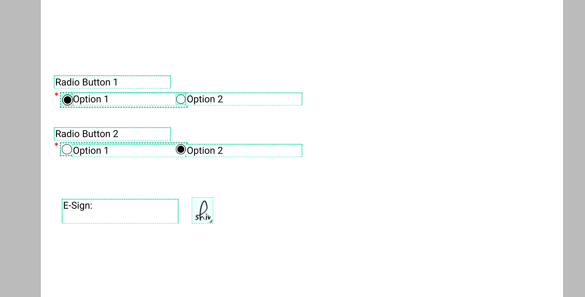
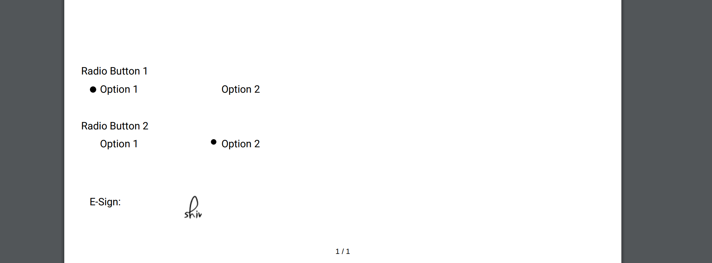

# eSign Workflow Application

This project implements a simple eSign workflow application using NestJS. It allows users to manage PDF documents with eSignatures integrated using Zoho eSign APIs.

## Features

- **Upload PDF:** Users can upload PDF documents which are stored in the backend directory.
- **Add eSign Tags:** Integrated with Zoho eSign API to add electronic signature tags such as radio buttons to the uploaded PDF.
- **Preview PDF:** Users can preview the PDF with eSign tags before submission.
- **Submit for eSign:** Upon submission, the application uses Zoho API to initiate the eSign process.

## Technologies Used

- **Backend:** NestJS
- **Frontend:** React Js

 ## Contact Me

- **E-Mail:** shivakumart67@gmail.com
  
## Home Page

## File Uploading

## Preview For Uploaded File and Submit for E-Sign

## Certificate Of Complition of E-Signed File

## Completing the Signature of the Document and Adding Details

The Text is just a default value and this can be editable

## E-signed Document

